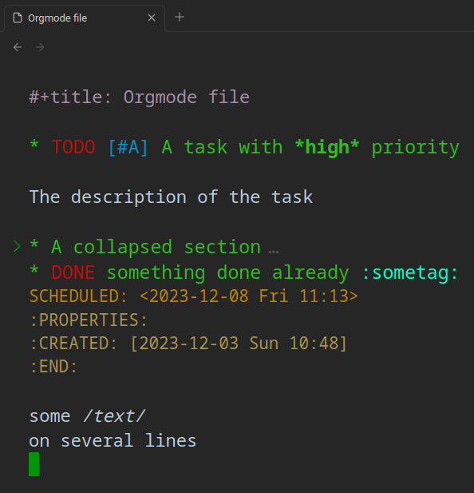

# Obsidian Orgmode CM6

[Orgmode](https://orgmode.org) for [Obsidian](https://obsidian.md).



## Usage

By default org files are not shown in the sidebar.
To display them you need to go into the obsidian settings, section `Files and links` and check `Detect all file extensions`.


To create an org file in your vault, you currently have to create it outside obsidian, as obsidian doesn't allow to create a non-markdown file.

If you don't already have an org file, try to create a file called `todo.org` with the following content:

```org
* TODO [#A] A task with *high* priority

The description of the task

* A collapsed section

You cannot see the description when collapsed

* DONE something done already :sometag:
SCHEDULED: <2023-12-08 Fri 11:13>
:PROPERTIES:
:CREATED: [2023-12-03 Sun 10:48]
:END:

a [[https://github.com/BBazard/obsidian-orgmode-cm6][link]]
```

## Supported features

### Orgmode Editor

- Live Preview
- Syntax highlighting (with overridable css classes)
- Customizable Todo Keywords in settings
- Folding (click in the gutter on the first line of the element to fold it)
- Wiki links (`[[unicorn]]` will open the file unicorn.org anywhere in the vault or fallback to unicorn.md)
- Inline images (`[[myimage.png]]` will display the image if it exists in the vault)
- ID links (`[[id:12345]]` will redirect to the heading with the matching :ID: in a property drawer located in any org file in the vault)
- Vim support (if activated in Obsidian)

### Orgmode Parser (syntax highlighting)

Following [Org Syntax](https://orgmode.org/worg/org-syntax.html)

- [x] Heading (nested, no support for COMMENT heading)
- [x] Section (including zeroth section)
- [x] Text markup (bold, italic, underline, etc...)
- [x] Link (regular link, angle link, plain link)
- [x] Combination of markup and link
- [x] Comment line
- [x] Keyword line
- [x] Planning line
- [x] Property Drawer
- [x] Lesser Block (all unformatted currently)
- [ ] Dynamic Block
- [ ] Drawer
- [ ] List and Checkbox
- [ ] Horizontal rule
- [ ] Timestamp
- [ ] Clock
- [ ] Diary Sexp
- [ ] Footnote
- [ ] Table
- [ ] Latex
- [ ] : Fixed-width line (you can use a Block instead)

## Implementation details

- The orgmode files are handled with a [codemirror 6](https://codemirror.net) instance which is separate from the one used by the markdown files. That means the plugin has to re-implement all features working for markdown files.

- The parser reads an orgmode file and builds a tree of syntax nodes by using a [lezer](https://lezer.codemirror.net) grammar with custom tokenizers. This approach allows to match tokens more precisely than the regex-based approach of Emacs. For example, planning lines are only matched after a heading and not in the middle of a section.

- Overlapping tokens are not considered valid. Take for example: `*one _two three* four_`. Emacs, using regexes would have `*one _two three*` as bold and `_two three* four_` as underline. The lezer parser is instead considering `*one _two three*` as bold and ` four_` as normal text, it makes it possible to have the text markup range as its own syntax node.

- There is no limits to the level of headings (so no Inlinetask) or the number of lines of a text markup.

## Show orgmode tasks in markdown files

This feature is unstable and will likely change in breaking ways in the future.

Currently only TODO and DONE are handled.

https://github.com/BBazard/obsidian-orgmode-cm6/assets/10139245/b071b2c8-b56e-4050-8fcf-02a922fdd1c0

## Development

```
git clone https://github.com/bbazard/obsidian-orgmode-cm6
cd obsidian-orgmode-cm6
npm install
npm run build
npm test
cp main.js styles.css manifest.json "$OBSIDIAN_VAULT"/.obsidian/plugins/obsidian-orgmode-cm6/
```
